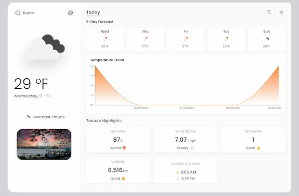
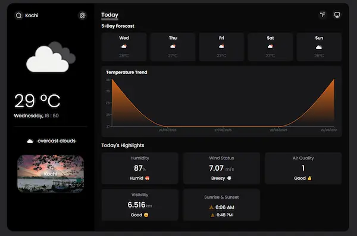

# 🌦️ Weather Forecast Web App

A modern, responsive weather web application built with React and OpenWeatherMap API. It shows current weather conditions, a 5-day forecast, temperature trends, air quality index, and geolocation-based weather data.

## 🚀 Features

- 🌍 Get weather based on your location
- 🔎 Search weather by city name
- 🌡️ Toggle temperature units (Celsius ↔ Fahrenheit)
- 📈 View 5-day forecast with temperature trend chart
- ☀️ Sunrise & sunset time
- 💨 Wind speed and humidity info
- 🏭 Air Quality Index with emoji-level indicators
- 🏙️ City image with name
- 🌘 Light / Dark mode toggle
- 📦 LocalStorage caching to reduce API calls

## 🛠️ Tech Stack

- **Frontend**: React + Vite
- **Styling**: CSS / Tailwind (optional)
- **Data Source**: [OpenWeatherMap API](https://openweathermap.org/api), [Unsplash API](https://unsplash.com/developers), 
- **Charting**: Recharts

## 📸 Screenshots


or



## 🧪 Setup Instructions

```bash
# 1. Clone the repo
git clone https://github.com/psathul073/weather-app.git

# 2. Navigate into the folder
cd weather-app

# 3. Install dependencies
npm install

# 4. Add your OpenWeatherMap and Unsplash API keys and URL`S
#    Create a .env file and add:
VITE_API_URL="your_api_url_here"
VITE_API_KEY="your_api_key_here"
VITE_UNSPLASH_API_URL="your_api_url_here"
VITE_UNSPLASH_API_KEY="your_api_key_here"

# 5. Run the app
npm run dev
